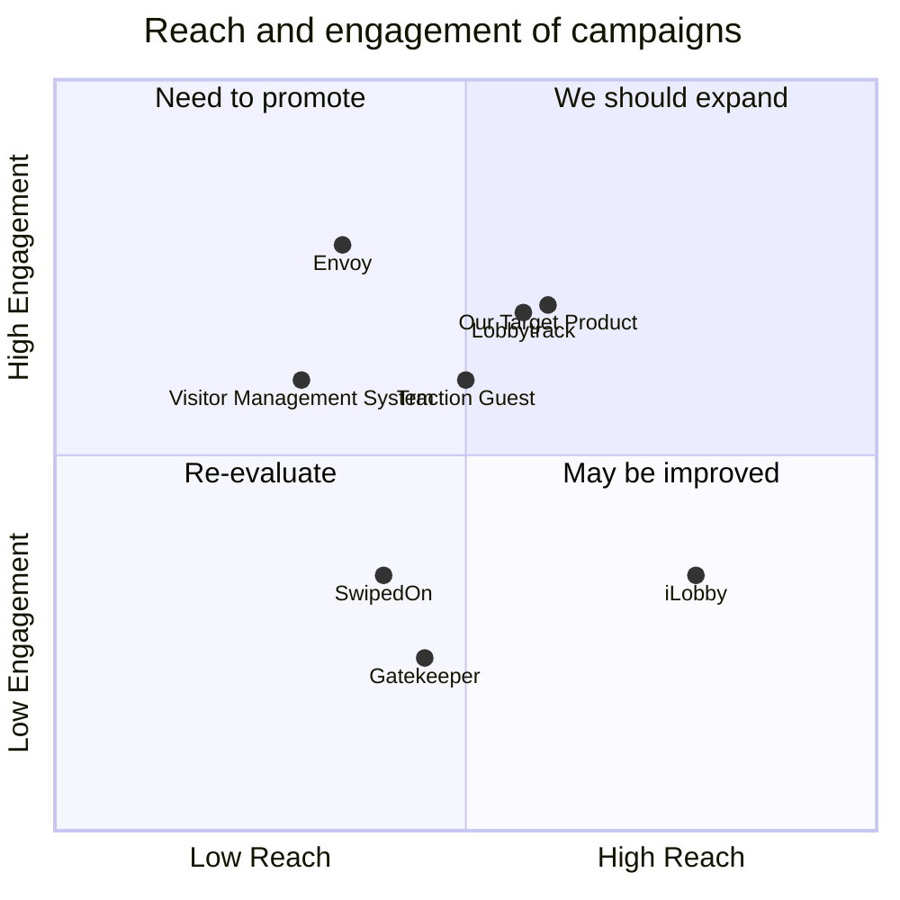

## Original Requirements
We are to create a resident web application that allows residents to schedule visits by providing details about the visitor. The details include the visitor's name, phone number, NIC, and vehicle number. The security personnel at the gate can then use the management application to search for scheduled visits. If the visitor is found in the scheduled visits, the security personnel can create an actual visit using the management app and allow the visitor to enter. If the visitor is not found in the scheduled visits, the security personnel can create a new scheduled visit in the management app. The resident of the house will be notified, and when any of them approve, the visitor will be allowed in by the security after creating an actual visit using the management app.

## Product Goals
```python
[
    "Create a user-friendly resident web application for scheduling visits",
    "Ensure efficient communication between residents, visitors, and security personnel",
    "Provide a secure and reliable system for managing visits"
]
```

## User Stories
```python
[
    "As a resident, I want to schedule a visit so that I can let the security know about my upcoming visitors",
    "As a security personnel, I want to search for scheduled visits so that I can verify the visitor's details",
    "As a visitor, I want my details to be registered so that I can be allowed in without any hassle",
    "As a resident, I want to be notified when a new visit is scheduled so that I can approve or disapprove it",
    "As a security personnel, I want to create an actual visit after the resident's approval so that I can let the visitor in"
]
```

## Competitive Analysis
```python
[
    "Visitor Management System: An application that allows for visitor registration, check-in, and tracking. However, it lacks the feature of resident notification and approval",
    "Gatekeeper: A visitor management software that provides features like visitor pre-registration and instant notifications. But it doesn't have the feature of creating an actual visit after resident's approval",
    "Lobbytrack: A comprehensive solution for visitor registration, tracking, and reporting. But it is not a web application and doesn't provide the feature of scheduling visits",
    "iLobby: A global leader in Enterprise Visitor Management. It provides pre-registration and notification features but lacks the feature of creating an actual visit",
    "SwipedOn: A user-friendly visitor management system. It lacks the feature of resident approval for unscheduled visits",
    "Envoy: A visitor registration product that is simple and intuitive. However, it doesn't provide the feature of resident notification and approval",
    "Traction Guest: An enterprise visitor management system. It provides a wide range of features but lacks the feature of creating an actual visit after resident's approval"
]
```

## Competitive Quadrant Chart


## Requirement Analysis
The product should be a web application that allows residents to schedule visits by providing visitor details. The application should also allow security personnel to search for scheduled visits, create actual visits, and manage unscheduled visits. The application should notify residents when a new visit is scheduled and allow them to approve or disapprove the visit.

## Requirement Pool
```python
[
    ("Create a resident web application for scheduling visits", "P0"),
    ("Implement a search feature for scheduled visits", "P0"),
    ("Implement a feature for creating actual visits", "P0"),
    ("Implement a notification system for new scheduled visits", "P1"),
    ("Implement a feature for resident approval of visits", "P1")
]
```

## UI Design draft
The application should have a clean and intuitive interface. The home page should have options for residents to schedule a visit and for security personnel to manage visits. The scheduling page should have a form for entering visitor details. The management page should have a search bar for finding scheduled visits and options for creating actual visits and managing unscheduled visits. The layout should be simple and easy to navigate.

## Anything UNCLEAR
There are no unclear points.