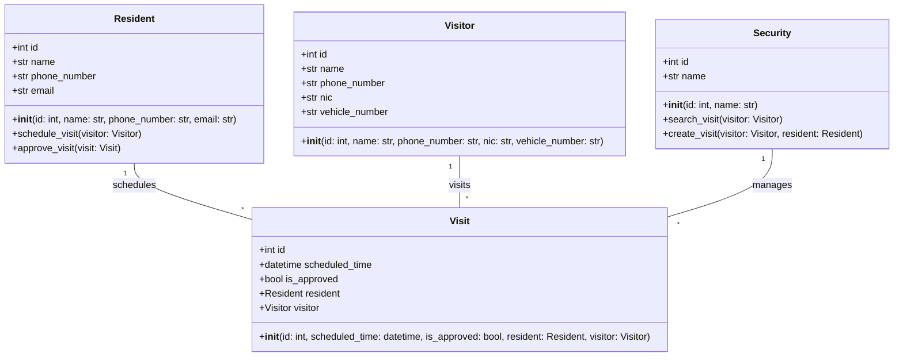
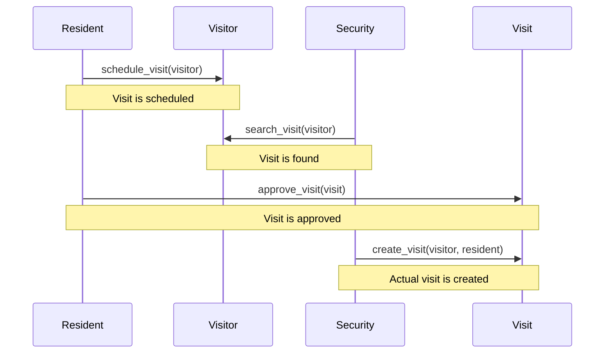

## Implementation approach
We will use Flask, a lightweight and flexible Python web framework, for building the web application. We will use SQLAlchemy as the ORM for database operations. For the frontend, we will use Bootstrap for responsive design and JQuery for handling user interactions. We will use Twilio for implementing the notification system. The application will follow the MVC (Model-View-Controller) architecture. The difficult point is to ensure the smooth communication between residents, visitors, and security personnel, and to handle the approval process efficiently.

## Python package name
```python
"resident_visit_management"
```

## File list
```python
[
    "main.py",
    "models.py",
    "views.py",
    "controllers.py",
    "templates/home.html",
    "templates/schedule_visit.html",
    "templates/manage_visit.html",
    "static/css/main.css",
    "static/js/main.js"
]
```

## Data structures and interface definitions


## Program call flow


## Anything UNCLEAR
The requirement is clear to me.